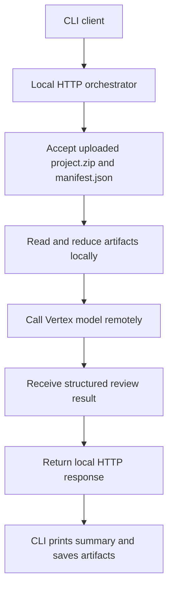

# Local Orchestrator With Remote Vertex Model

## Problem Frame
The project currently supports a fully local review path and a deployed Agent Engine path, but it does not yet support the architecture the user actually wants to learn: a local service runtime that keeps orchestration and file handling on the developer machine while sending only model inference to Vertex AI. The goal is to make the local architecture resemble a future hosted service, with the existing CLI acting as a client over local HTTP rather than performing orchestration directly.

## Requirements

**Execution Shape**
- R1. The system must support a first-class local-orchestrator mode where orchestration runs on the local machine and only model inference is sent to Vertex AI.
- R2. The local orchestrator must be exposed as an HTTP API running on the developer machine.
- R3. The existing CLI must act as an HTTP client of the local orchestrator in this mode rather than performing review orchestration directly.

**Submission Contract**
- R4. The local orchestrator must accept uploaded `project.zip` and `manifest.json` artifacts over HTTP rather than requiring local filesystem paths in the API contract.
- R5. The local submission contract should remain close enough to the hosted shape that moving the orchestrator into a remote service later does not require redesigning the client contract.
- R6. The orchestrator must perform manifest parsing, artifact inspection, context reduction, and result assembly locally.

**Model Interaction**
- R7. The orchestrator must send only reduced review context to the remote Vertex model rather than forwarding the entire raw project or raw manifest blindly.
- R8. The model-facing contract must return structured review output that the local orchestrator can validate and then return over HTTP.

**Developer Workflow**
- R9. The project must provide explicit command-line steps for starting the local orchestrator and testing it from the CLI.
- R10. A developer must be able to run the local service and CLI separately on one machine without requiring Agent Engine deployment.

## Success Criteria
- A developer can start a local orchestrator process, point the CLI at it, and complete a review run where only the LLM inference goes to Vertex AI.
- The local HTTP request shape is similar enough to a future hosted service that the client contract remains useful if the orchestrator is later moved off-machine.
- The command-line workflow is simple enough that the user can test and inspect the system end to end without needing the Cloud Console.

## Scope Boundaries
- No requirement to remove the existing deployed Agent Engine path.
- No requirement to support local file-path inputs as the primary API contract for this mode.
- No requirement in v1 to support multiple external clients beyond the CLI.
- No requirement in v1 to perfectly replicate every runtime behavior of Agent Engine.

## Key Decisions
- Local HTTP first: Treat the local orchestrator as a service boundary, not as an internal helper library.
- Upload contract for parity: Accept artifacts over HTTP so the interface resembles a future hosted service more than a purely local helper would.
- CLI as client: Preserve the CLI as the main user entrypoint while moving orchestration responsibility into the service.
- Remote model only: Keep manifest reduction, archive handling, and result shaping local; only send reduced inference context to Vertex.

## Dependencies / Assumptions
- The developer machine can authenticate to Vertex AI locally using Application Default Credentials or equivalent local credentials.
- The orchestrator can call Vertex models directly without requiring Agent Engine deployment.
- The uploaded artifacts are small enough for local HTTP transport in the initial version.

## Outstanding Questions

### Deferred to Planning
- [Affects R2][Technical] What is the thinnest viable local HTTP stack for this service while preserving testability and readability?
- [Affects R4][Technical] Should the HTTP API accept multipart uploads, raw binary plus metadata, or another upload shape?
- [Affects R7][Needs research] What reduced review context should be sent to the Vertex model in v1 so the service avoids context blow-up while still producing useful dbt review results?
- [Affects R9][Technical] What exact CLI flags and command lines should be added for starting the local service and pointing the CLI at it?
- [Affects R5][Technical] Which parts of the existing deployed-agent contract should be preserved verbatim and which should diverge for the local-service path?

## Next Steps
→ /prompts:ce-plan for structured implementation planning
