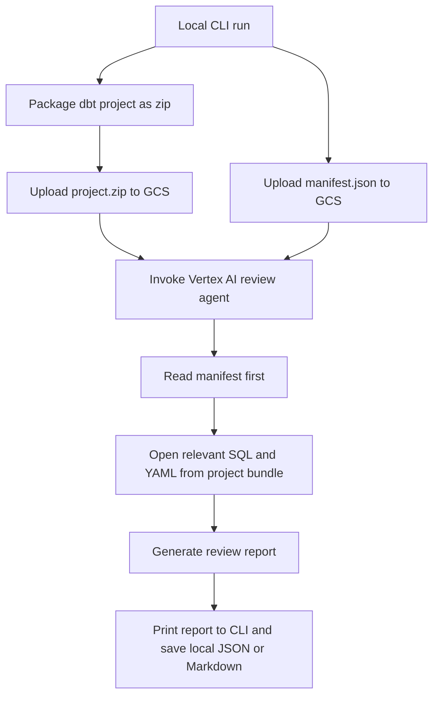

# Vertex AI dbt Review Agent

## Problem Frame
The project needs a practical way to review dbt projects with a GCP Vertex AI Agent before any CI or PR automation exists. The first version should work from local development, accept a full dbt project submission, and use `manifest.json` as the structured analysis harness so the agent can reason about lineage, metadata, and model relationships before opening source files.

## Requirements

**Submission Flow**
- R1. The first release must support review runs initiated by a local CLI command.
- R2. Each review run must upload the full dbt project as a source bundle rather than relying on partial file submission.
- R3. Each review run must upload `manifest.json` as a separate artifact in addition to the source bundle.

**Analysis Behavior**
- R4. The agent must use a hybrid review approach: start from `manifest.json` for structure and then inspect relevant project files from the uploaded source bundle.
- R5. The first review mode must focus on dbt correctness and quality, including model SQL, schema YAML, tests, refs, sources, and common dbt anti-patterns.
- R6. The review flow should prefer targeted file inspection over reading every file in the bundle when the manifest already narrows the analysis surface.

**Output**
- R7. The first release must return the review result directly in the CLI.
- R8. The CLI must save a machine-readable and/or human-readable review artifact locally for debugging and iteration.

## Success Criteria
- A developer can run one local command against a dbt project and receive a useful review report without manual cloud-console steps during each run.
- The agent can reason over dbt graph metadata from `manifest.json` and cite relevant source files from the uploaded project bundle.
- The v1 flow is simple enough to debug locally before adding CI or Git-triggered automation.

## Scope Boundaries
- No GitHub PR trigger or CI automation in v1.
- No differential upload, caching, or changed-file-only submission in v1.
- No requirement in v1 to persist review results in GCS or another remote store.
- No requirement in v1 to optimize for the smallest possible upload payload.

## Key Decisions
- Hybrid ingestion: Use `manifest.json` as the primary harness for structural analysis, then inspect source files selectively to ground findings in project code.
- Local CLI first: Start with an explicit local workflow to reduce infrastructure complexity and accelerate iteration.
- Full upload per run: Favor reliability and debuggability over bandwidth optimization in the first release.
- CLI-first output: Return results to the developer immediately and save local artifacts for inspection.

## Dependencies / Assumptions
- The local environment will be authenticated to GCP and able to upload artifacts to a GCS bucket.
- The reviewed dbt project produces a valid `manifest.json` before submission.
- A Vertex AI Agent runtime will be able to access the uploaded GCS objects for the run.

## Outstanding Questions

### Deferred to Planning
- [Affects R1][Technical] What is the thinnest viable CLI shape for local development: shell script, Python CLI, or another wrapper?
- [Affects R3][Technical] Should `manifest.json` be uploaded as a standalone object only, or also included redundantly inside the source bundle?
- [Affects R5][Needs research] Which dbt quality checks should be hard requirements versus heuristic best-practice guidance in the prompt and evaluation logic?
- [Affects R7][Technical] What local output format should be primary in v1: Markdown, JSON, or both?
- [Affects R1][Needs research] Which Vertex AI Agent surface is the best fit for this workflow in current GCP tooling, and what request shape should the CLI send?

## Next Steps
→ /prompts:ce-plan for structured implementation planning
