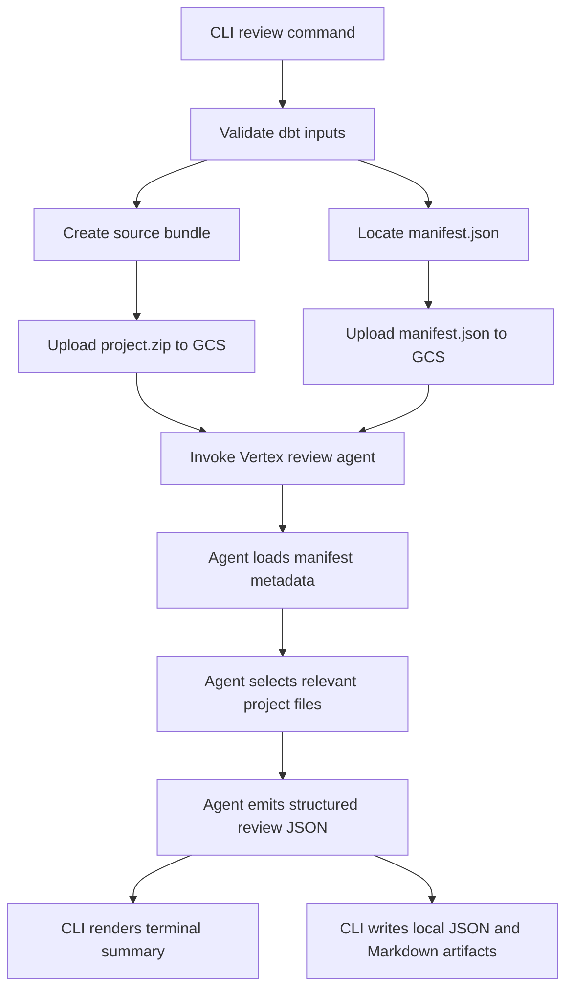
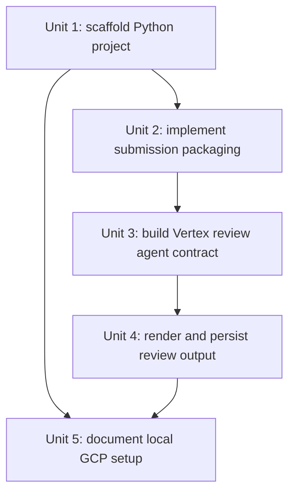

# feat: build vertex dbt review agent v1

## Overview

Build both halves of the v1 system: a Vertex AI dbt review agent runtime that performs manifest-first analysis plus targeted source inspection, and a local Python CLI that packages a dbt project, uploads `project.zip` and `manifest.json` to GCS, invokes that agent, and writes review output to the terminal plus local JSON and Markdown artifacts.

## Problem Frame

The project needs a complete end-to-end review system, not just a submission tool: a local developer workflow for sending dbt projects into GCP and an agent runtime that can analyze those projects meaningfully once received. The chosen product shape is a hybrid review flow that uses `manifest.json` for graph-aware analysis and source files for targeted evidence collection (see origin: `docs/brainstorms/2026-04-05-vertex-ai-dbt-review-agent-requirements.md`).

## Requirements Trace

- R1. Support review runs from a local CLI command.
- R2. Upload the full dbt project as a source bundle for each run.
- R3. Upload `manifest.json` as a separate artifact for each run.
- R4. Use manifest-first analysis with selective source inspection.
- R5. Focus v1 review behavior on dbt correctness and quality.
- R6. Prefer targeted source inspection rather than reading the full bundle blindly.
- R7. Return review output directly in the CLI.
- R8. Save local artifacts for debugging and iteration.

## Scope Boundaries

- No GitHub-triggered or CI-triggered review flow in this plan.
- No differential upload, local caching, or changed-file-only packaging.
- No remote persistence requirement for review output beyond the source artifacts already uploaded for a run.
- No attempt in v1 to build a generic multi-framework review system beyond dbt.

## Context & Research

### Relevant Code and Patterns

- The repository is currently empty aside from planning artifacts, so there are no local package, CLI, testing, or deployment conventions to follow.
- Because the repo has no existing language bias, the plan should choose the language that best matches Vertex AI agent development and GCS integration rather than force a compatibility constraint that does not exist.

### Institutional Learnings

- No `docs/solutions/` artifacts exist yet, so the plan should optimize for simple structure and strong local debuggability.

### External References

- Google Cloud documents Agent Engine as the deployment/runtime surface for Vertex AI agents and recommends framework-based development, including the Agent Development Kit: https://cloud.google.com/vertex-ai/generative-ai/docs/agent-engine/develop/overview
- Vertex AI Agent Engine overview documents supported regions, which matters for initial project and bucket setup: https://cloud.google.com/vertex-ai/generative-ai/docs/reasoning-engine/overview
- Google Cloud Storage documents object upload patterns through the Python client library, which fits the planned CLI upload path: https://docs.cloud.google.com/storage/docs/samples/storage-stream-file-upload

## Key Technical Decisions

- Use Python for both the local CLI and the review agent.
  Rationale: Vertex AI agent development is best-supported from Python today, and using one language for packaging, upload, invocation, and local testing reduces integration friction in an otherwise empty repo.
- Upload `manifest.json` as a standalone GCS object and also allow it to remain inside the source bundle naturally.
  Rationale: The standalone object gives the agent a stable, direct URI for structured analysis, while the zipped project remains a faithful submission of the dbt workspace.
- Make JSON the canonical review response shape and derive Markdown and terminal output from that structure.
  Rationale: JSON is easier to validate, store, and evolve. Markdown and terminal rendering can remain presentation layers over the same review schema.
- Start with a single CLI command and a single review-agent entrypoint.
  Rationale: The repo has no existing command surface, and v1 should optimize for getting one complete end-to-end loop working before adding subcommands, auxiliary tools, or multiple agent personas.

## Open Questions

### Resolved During Planning

- What is the thinnest viable CLI shape for local development?
  Resolution: A Python CLI package with one main review command is the thinnest viable shape because it can own zipping, manifest validation, GCS upload, agent invocation, and local artifact rendering without shell-script sprawl.
- Should `manifest.json` be uploaded as a standalone object only, or also included redundantly inside the source bundle?
  Resolution: Upload it as a standalone object for the agent contract and tolerate its presence in the zipped project bundle without adding special exclusion logic.
- What local output format should be primary in v1?
  Resolution: Use structured JSON as the primary internal contract and produce Markdown alongside it for human-readable inspection.

### Deferred to Implementation

- Which exact Agent Engine SDK request and session shape best fits the final agent runtime wiring?
  Why deferred: This depends on the exact Python libraries and runtime surface chosen during implementation, but it does not change the plan’s architecture.
- Which dbt quality checks should be strict rule-based findings versus softer heuristic guidance?
  Why deferred: The implementation should refine this after the first prompt and result schema exist, so the review policy can be calibrated against realistic sample projects.

## High-Level Technical Design

> *This illustrates the intended approach and is directional guidance for review, not implementation specification. The implementing agent should treat it as context, not code to reproduce.*

## Implementation Units

- [ ] **Unit 1: Scaffold the Python CLI and agent package**

**Goal:** Establish a minimal Python project layout that can host the local CLI, shared submission models, and the Vertex dbt review agent runtime.

**Requirements:** R1, R7, R8

**Dependencies:** None

**Files:**
- Create: `pyproject.toml`
- Create: `README.md`
- Create: `src/dbt_vertex_agent/__init__.py`
- Create: `src/dbt_vertex_agent/cli.py`
- Create: `src/dbt_vertex_agent/config.py`
- Create: `src/dbt_vertex_agent/models.py`
- Create: `src/dbt_vertex_agent/agent.py`
- Test: `tests/test_cli.py`
- Test: `tests/test_config.py`

**Approach:**
- Choose a small Python packaging and CLI setup that exposes one top-level review command.
- Centralize environment-driven configuration for project ID, region, staging bucket, and output directory so later units do not hardcode cloud settings.
- Define typed request and response models early so packaging, agent invocation, and rendering share one contract.

**Patterns to follow:**
- No local code patterns exist; prefer a plain `src/` package layout, small modules, and typed data models over framework-heavy scaffolding.

**Test scenarios:**
- Happy path: invoking the CLI with a valid project path and manifest path constructs a review request object with expected config values.
- Edge case: missing required environment configuration produces a clear validation error before upload work begins.
- Error path: invalid CLI arguments return a non-zero exit path with actionable usage guidance.

**Verification:**
- A developer can install the package locally and reach a single review command that validates arguments and configuration without performing the full remote review yet.

- [ ] **Unit 2: Implement dbt project packaging and GCS artifact upload**

**Goal:** Build the local submission pipeline that validates dbt inputs, zips the project, uploads `project.zip`, uploads `manifest.json`, and returns stable run artifact URIs.

**Requirements:** R1, R2, R3, R8

**Dependencies:** Unit 1

**Files:**
- Modify: `src/dbt_vertex_agent/cli.py`
- Create: `src/dbt_vertex_agent/packaging.py`
- Create: `src/dbt_vertex_agent/storage.py`
- Create: `src/dbt_vertex_agent/run_context.py`
- Test: `tests/test_packaging.py`
- Test: `tests/test_storage.py`
- Test: `tests/test_cli.py`

**Approach:**
- Validate that the provided dbt project path exists and that `manifest.json` is readable before any remote calls.
- Generate a unique run identifier and consistent object key layout such as `submissions/<run-id>/project.zip` and `submissions/<run-id>/manifest.json`.
- Keep packaging rules explicit enough to include the dbt project faithfully while avoiding obviously irrelevant local clutter where safe.
- Return a submission descriptor object containing run ID, bucket, and uploaded artifact URIs for downstream agent invocation.

**Execution note:** Implement new packaging behavior test-first because file selection and path normalization are easy to regress silently.

**Patterns to follow:**
- Use the same typed request and response models introduced in Unit 1 rather than ad hoc dictionaries between modules.

**Test scenarios:**
- Happy path: a valid dbt project path and manifest path produce a zip artifact and two expected GCS object destinations in the submission descriptor.
- Edge case: a project containing nested model directories preserves repo-relative paths inside the generated zip.
- Edge case: a manifest path outside the project root still uploads successfully and records its standalone URI.
- Error path: missing manifest file fails before any upload attempt.
- Error path: GCS upload failure surfaces a clear submission error that includes which artifact failed.
- Integration: the CLI review flow receives uploaded artifact URIs from the packaging layer and passes them unchanged into the downstream review request.

**Verification:**
- Given a sample dbt project, the packaging layer can create reproducible run artifact metadata and upload both required objects to GCS.

- [ ] **Unit 3: Implement the Vertex AI dbt review agent runtime**

**Goal:** Implement the actual dbt review agent runtime and request contract that accept uploaded artifact URIs, load manifest metadata first, and perform targeted source inspection for dbt quality review.

**Requirements:** R4, R5, R6, R7

**Dependencies:** Unit 1, Unit 2

**Files:**
- Modify: `src/dbt_vertex_agent/agent.py`
- Create: `src/dbt_vertex_agent/review_contract.py`
- Create: `src/dbt_vertex_agent/review_policy.py`
- Create: `src/dbt_vertex_agent/manifest_analysis.py`
- Create: `src/dbt_vertex_agent/source_reader.py`
- Test: `tests/test_manifest_analysis.py`
- Test: `tests/test_review_contract.py`
- Test: `tests/test_agent.py`

**Approach:**
- Define a single review request shape that includes run metadata plus the `project.zip` and `manifest.json` URIs.
- Parse `manifest.json` into an internal graph-aware representation that can identify high-value nodes, tests, refs, sources, exposures, and candidate files to inspect.
- Restrict source inspection to the files implicated by manifest analysis and review policy rather than blindly traversing the full archive.
- Standardize a structured finding schema that distinguishes hard failures, warnings, and informational guidance so the CLI renderer can remain simple.
- Keep the agent runtime independently testable from the CLI so the review logic can later be deployed, invoked, or benchmarked without local packaging concerns.

**Technical design:** *(directional guidance, not implementation specification)*
- Input contract includes: submission metadata, artifact URIs, and optional review settings.
- Agent workflow follows: load manifest -> derive review targets -> read matching source files -> generate structured findings -> emit normalized review result.

**Patterns to follow:**
- Keep review policy separate from transport and storage code so prompt and rule iteration does not require rewriting packaging or CLI modules.

**Test scenarios:**
- Happy path: a manifest containing models, tests, and sources yields a review target set tied to the expected dbt nodes.
- Edge case: a manifest with missing optional sections still produces a valid but reduced review target set.
- Edge case: multiple models sharing macros or sources do not cause duplicate source-inspection targets in the review result.
- Error path: unreadable or invalid manifest content returns a structured review failure rather than an untyped exception.
- Error path: missing source files referenced by the manifest produce a degraded review result that records the missing evidence.
- Integration: a review request built from uploaded artifact URIs can flow through the agent entrypoint and return normalized findings in the agreed JSON schema.

**Verification:**
- The agent can accept artifact URIs, derive targeted inspection candidates from the manifest, and return stable structured findings without requiring CLI-specific logic.

- [ ] **Unit 4: Render terminal output and persist local review artifacts**

**Goal:** Convert structured review results into concise terminal output plus saved JSON and Markdown artifacts for local debugging and iteration.

**Requirements:** R7, R8

**Dependencies:** Unit 1, Unit 3

**Files:**
- Modify: `src/dbt_vertex_agent/cli.py`
- Create: `src/dbt_vertex_agent/rendering.py`
- Create: `src/dbt_vertex_agent/output.py`
- Test: `tests/test_rendering.py`
- Test: `tests/test_cli.py`

**Approach:**
- Treat JSON as the canonical result object and render terminal and Markdown views from the same normalized structure.
- Save outputs under a predictable local run directory keyed by run ID so submission artifacts and review artifacts can be inspected together.
- Keep terminal output short and decision-oriented while preserving richer detail in saved Markdown and JSON files.

**Patterns to follow:**
- Reuse the response and finding models from Unit 3 instead of formatting directly from raw agent responses.

**Test scenarios:**
- Happy path: a successful review result is printed as a concise terminal summary and written to both JSON and Markdown files.
- Edge case: a review result with zero findings still renders a valid success summary and artifact files.
- Error path: an agent-side failure result renders clearly without pretending the review succeeded.
- Integration: the CLI review command writes artifacts into the expected run directory and reports their paths to the user.

**Verification:**
- A completed review run leaves readable local artifacts and a terminal summary that a developer can act on without opening cloud tooling.

- [ ] **Unit 5: Document local GCP setup and sample submission workflow**

**Goal:** Add onboarding documentation for local authentication, bucket setup, required environment variables, and the end-to-end review workflow.

**Requirements:** R1, R7, R8

**Dependencies:** Unit 1, Unit 2, Unit 4

**Files:**
- Modify: `README.md`
- Create: `docs/local-development.md`

**Approach:**
- Document the minimum GCP setup: project selection, Agent Engine region, staging bucket, and local Application Default Credentials.
- Document the expected dbt inputs and the command shape for running a review locally.
- Include the local artifact layout so debugging a failed submission or failed review is straightforward.

**Patterns to follow:**
- Keep setup guidance imperative and minimal; prefer one working path over multiple environment variants in v1.

**Test scenarios:**
- Test expectation: none -- documentation-only unit with no behavioral code change.

**Verification:**
- A new developer with a GCP project can configure local access and understand how to run the full submission and review loop without reading source code first.

## System-Wide Impact

- **Interaction graph:** The CLI becomes the single entrypoint for local review, the packaging layer owns artifact creation and GCS upload, and the agent layer owns manifest-first review behavior.
- **Error propagation:** Configuration, packaging, upload, and agent failures should be normalized into structured CLI-visible errors rather than leaking raw SDK exceptions.
- **State lifecycle risks:** Uploaded source artifacts and local output artifacts will accumulate per run, so the implementation should keep run IDs explicit and avoid overwriting prior results.
- **API surface parity:** The structured review request and response models should be stable enough to support a later CI or PR trigger without redefining the contract.
- **Integration coverage:** End-to-end tests should prove that packaged artifact metadata flows into the agent request and that normalized findings flow back into CLI rendering.
- **Unchanged invariants:** This plan does not introduce GitHub automation, diff-aware review, or remote result storage in v1.

## Risks & Dependencies

| Risk | Mitigation |
|------|------------|
| Current Vertex AI agent runtime APIs may differ slightly from the planned abstraction | Keep the transport boundary narrow by isolating agent invocation behind `agent.py` and storing the request contract in typed models |
| dbt project packaging may accidentally omit files required for review | Add packaging tests against representative sample project structures and keep initial exclusion rules conservative |
| `manifest.json` quality varies across dbt versions and project states | Handle partial or invalid manifest inputs as structured failures and keep manifest parsing isolated from rendering |
| Local GCP auth/setup friction blocks early iteration | Provide explicit README and local setup documentation before expanding the runtime surface |

## Documentation / Operational Notes

- Document the expected environment variables, supported region choice, and staging bucket contract in `README.md` and `docs/local-development.md`.
- Keep the initial run artifact path scheme stable so future cleanup, retention, or remote-result features can build on it without reworking the submission layout.

## Sources & References

- **Origin document:** `docs/brainstorms/2026-04-05-vertex-ai-dbt-review-agent-requirements.md`
- External docs: https://cloud.google.com/vertex-ai/generative-ai/docs/agent-engine/develop/overview
- External docs: https://cloud.google.com/vertex-ai/generative-ai/docs/reasoning-engine/overview
- External docs: https://docs.cloud.google.com/storage/docs/samples/storage-stream-file-upload
