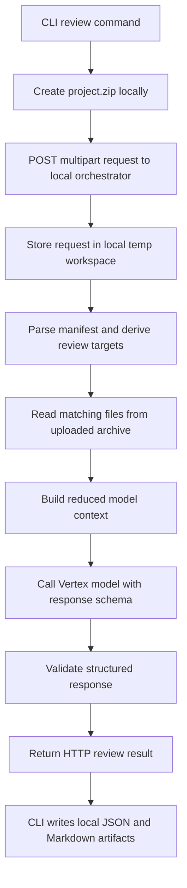
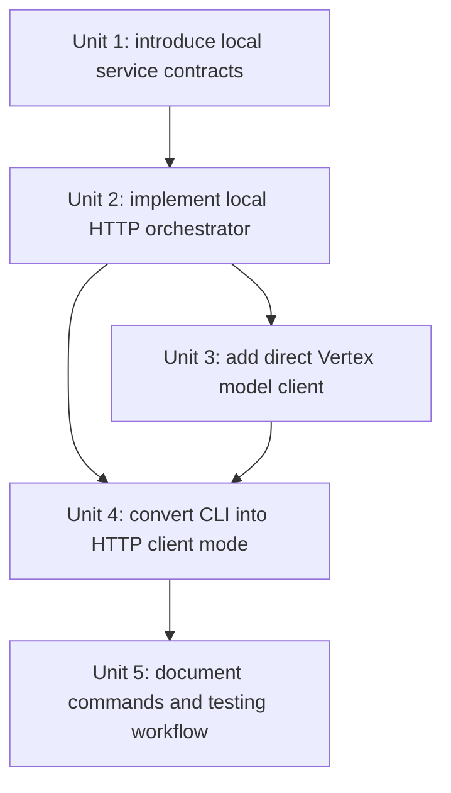

# feat: add local http orchestrator mode

## Overview

Add a second first-class execution mode where the CLI uploads `project.zip` and `manifest.json` to a local HTTP orchestrator running on the developer machine. That local service performs manifest reduction, archive inspection, and result validation locally, then sends only reduced review context to a remote Vertex model and returns structured review output back to the CLI.

## Problem Frame

The current repo supports direct local orchestration and a deployed Agent Engine path, but neither matches the learning goal of “host-like architecture with local compute.” The new mode should teach a service-oriented shape without requiring Agent Engine deployment, while preserving a realistic upload contract and explicit command-line workflow (see origin: `docs/brainstorms/2026-04-05-local-orchestrator-remote-model-requirements.md`).

## Requirements Trace

- R1. Support a first-class local-orchestrator mode where only model inference is remote.
- R2. Expose the local orchestrator as an HTTP API on the developer machine.
- R3. Make the existing CLI a client of the local orchestrator in this mode.
- R4. Accept uploaded `project.zip` and `manifest.json` over HTTP.
- R5. Keep the local HTTP contract close to a future hosted-service contract.
- R6. Perform manifest parsing, artifact inspection, context reduction, and result assembly locally.
- R7. Send only reduced context to the Vertex model.
- R8. Require structured model output that can be validated before returning HTTP responses.
- R9. Provide explicit command-line steps for starting the service and testing from the CLI.
- R10. Allow local service and CLI to run separately on one machine without Agent Engine deployment.

## Scope Boundaries

- Do not remove or rewrite the existing Agent Engine deployment path.
- Do not add multiple external clients beyond the CLI in v1.
- Do not make local file paths part of the primary HTTP contract for this mode.
- Do not attempt perfect runtime parity with Agent Engine internals; preserve contract parity where it matters.

## Context & Research

### Relevant Code and Patterns

- `src/dbt_vertex_agent/cli.py` already owns request normalization, submission orchestration, and output writing. That file should be simplified into a client role for the local HTTP path rather than remain the orchestrator itself.
- `src/dbt_vertex_agent/packaging.py` already produces `project.zip` and `manifest.json` submission artifacts, which can be reused to build multipart HTTP requests instead of GCS-only uploads.
- `src/dbt_vertex_agent/agent.py`, `src/dbt_vertex_agent/manifest_analysis.py`, `src/dbt_vertex_agent/source_reader.py`, and `src/dbt_vertex_agent/review_policy.py` already separate deterministic review steps from the ADK wrapper. Those functions are good candidates to move behind the local orchestrator.
- `src/dbt_vertex_agent/remote.py` currently targets Agent Engine. The new mode should add a second remote path for direct Vertex model calls rather than overload the Agent Engine client.

### Institutional Learnings

- `docs/solutions/best-practices/teaching-comments-and-thin-agent-boundaries-2026-04-05.md` recommends keeping the LLM-facing layer thin and most logic deterministic in normal Python modules. This plan should preserve that architecture: the local HTTP service orchestrates deterministic steps locally and uses the model as one downstream dependency rather than as the whole application runtime.

### External References

- Vertex AI supports controlled JSON output with `response_mime_type` and `response_schema`, which is the right fit for a local orchestrator that must validate model responses before replying over HTTP: https://cloud.google.com/vertex-ai/generative-ai/docs/samples/generativeaionvertexai-gemini-controlled-generation-response-schema-2
- Google Cloud local development authentication guidance confirms ADC as the expected auth path for local Python clients calling Vertex directly: https://cloud.google.com/docs/authentication/set-up-adc-local-dev-environment

## Key Technical Decisions

- Use a small Python HTTP API in-process on the local machine and treat it as the main orchestrator boundary.
  Rationale: This gives the user the hosted-service shape they want to learn without introducing a second deployment target immediately.
- Accept multipart artifact uploads for `project.zip` and `manifest.json`.
  Rationale: Multipart uploads preserve the hosted-service mental model better than local file paths while staying easy to test from `curl` and the CLI.
- Keep review reduction local and use direct Vertex model calls rather than Agent Engine for this mode.
  Rationale: This satisfies the “local compute, remote model only” requirement and avoids paying the complexity cost of a hosted agent when local orchestration is the whole point.
- Require structured JSON model output validated against the existing review contract.
  Rationale: The orchestrator should not trust free-form LLM output when it is acting as an API server for downstream clients.
- Keep the existing deployed Agent Engine path as a separate execution mode.
  Rationale: The project is now explicitly teaching two architectures: deployed-agent and local-service. Merging them would make the code harder to reason about.

## Open Questions

### Resolved During Planning

- What is the thinnest viable local HTTP stack while preserving testability and readability?
  Resolution: Use a lightweight Python web stack with first-class file upload support and a built-in test client so the service boundary can be exercised without network-heavy integration scaffolding.
- Should the HTTP API accept multipart uploads, raw binary plus metadata, or another upload shape?
  Resolution: Use multipart form-data with separate `project.zip` and `manifest.json` parts so the interface is easy to test manually and maps well to future hosted deployments.
- What exact CLI workflow should be supported?
  Resolution: Support a dedicated local-service command to start the server and a review command flag or config field pointing the CLI at the local orchestrator base URL.
- Which parts of the existing contract should be preserved?
  Resolution: Preserve the `ReviewResult` JSON shape and run-oriented artifact model; change only the transport and the remote-model integration path.

### Deferred to Implementation

- What reduced review context should be sent to the Vertex model in the first version of this mode?
  Why deferred: The exact reduction strategy will be easier to finalize once the service endpoint and model client code exist, but it should remain bounded and contract-driven.
- Which exact Vertex SDK surface produces the cleanest structured-output flow in this repo’s Python version range?
  Why deferred: This should be confirmed while wiring the direct model client, but it does not change the service/client architecture.

## High-Level Technical Design

> *This illustrates the intended approach and is directional guidance for review, not implementation specification. The implementing agent should treat it as context, not code to reproduce.*

## Implementation Units

- [ ] **Unit 1: Introduce local-service request and response contracts**

**Goal:** Define explicit service-layer models for multipart uploads, local orchestrator requests, reduced model context, and HTTP responses while preserving the existing `ReviewResult` shape.

**Requirements:** R1, R5, R8

**Dependencies:** None

**Files:**
- Modify: `src/dbt_vertex_agent/models.py`
- Modify: `src/dbt_vertex_agent/review_contract.py`
- Create: `src/dbt_vertex_agent/service_contract.py`
- Test: `tests/test_review_contract.py`
- Test: `tests/test_service_contract.py`

**Approach:**
- Add service-specific models rather than overloading the current CLI/upload types with HTTP-only concerns.
- Preserve `ReviewResult` as the core response schema so the orchestrator, CLI, and future hosted modes can share it.
- Introduce an explicit reduced-context model so the system has a visible contract between local reduction and remote model inference.

**Patterns to follow:**
- Mirror the existing immutable dataclass style in `src/dbt_vertex_agent/models.py` and `src/dbt_vertex_agent/review_contract.py`.

**Test scenarios:**
- Happy path: service request models serialize the expected upload metadata and review settings.
- Edge case: reduced-context model supports an empty reviewed-file set without breaking response construction.
- Error path: malformed model-response payload fails validation before a `ReviewResult` is returned to the CLI.

**Verification:**
- The codebase has clear type boundaries for service upload handling, model prompts, and final review responses.

- [ ] **Unit 2: Implement the local HTTP orchestrator**

**Goal:** Add a local HTTP API that accepts multipart `project.zip` and `manifest.json` uploads, unpacks them into a temporary workspace, performs local manifest reduction and archive inspection, and returns a structured review response.

**Requirements:** R1, R2, R4, R6, R10

**Dependencies:** Unit 1

**Files:**
- Create: `src/dbt_vertex_agent/service.py`
- Create: `src/dbt_vertex_agent/service_handlers.py`
- Create: `src/dbt_vertex_agent/service_settings.py`
- Modify: `src/dbt_vertex_agent/manifest_analysis.py`
- Modify: `src/dbt_vertex_agent/source_reader.py`
- Test: `tests/test_service.py`
- Test: `tests/test_manifest_analysis.py`

**Approach:**
- Choose a minimal Python web stack that supports multipart uploads and offers an in-process test client.
- Accept `project.zip` and `manifest.json` as explicit multipart parts and write them into a temporary per-request workspace.
- Reuse the existing deterministic review helpers where possible, but shift them to operate on request-local uploaded artifacts instead of assuming CLI/GCS-driven orchestration.
- Return `ReviewResult` JSON over HTTP, even for validation failures, so the CLI has one stable contract to consume.

**Execution note:** Implement the service endpoint test-first with request fixtures for multipart uploads and malformed payloads.

**Patterns to follow:**
- Preserve the current “thin orchestration over deterministic helpers” pattern from `src/dbt_vertex_agent/agent.py` and `src/dbt_vertex_agent/review_policy.py`.

**Test scenarios:**
- Happy path: multipart upload with valid `project.zip` and `manifest.json` returns a successful JSON review response.
- Edge case: upload where the manifest references files not present in the zip returns warning findings rather than a server crash.
- Edge case: a zip containing nested model paths preserves those relative paths through the service pipeline.
- Error path: missing `manifest.json` upload returns a structured 4xx response with an actionable error.
- Error path: invalid zip payload returns a structured 4xx response rather than an untyped exception.
- Integration: the HTTP handler passes uploaded artifacts through manifest reduction and review policy without requiring the CLI process.

**Verification:**
- A developer can start the local server and submit multipart artifacts directly with `curl` to get a valid JSON review response.

- [ ] **Unit 3: Add direct Vertex model inference with structured output**

**Goal:** Replace the Agent Engine dependency for this mode with a direct Vertex model client that sends reduced review context and expects structured JSON output.

**Requirements:** R1, R6, R7, R8

**Dependencies:** Unit 1, Unit 2

**Files:**
- Create: `src/dbt_vertex_agent/model_client.py`
- Create: `src/dbt_vertex_agent/context_builder.py`
- Create: `src/dbt_vertex_agent/prompting.py`
- Modify: `src/dbt_vertex_agent/config.py`
- Modify: `src/dbt_vertex_agent/service_handlers.py`
- Test: `tests/test_model_client.py`
- Test: `tests/test_service.py`

**Approach:**
- Add a direct Vertex model client separate from `src/dbt_vertex_agent/remote.py`, which should remain dedicated to deployed Agent Engine querying.
- Build reduced model context locally from manifest-derived targets and matched source snippets rather than sending full raw artifacts.
- Require structured JSON output using Vertex response-schema support and validate that output before translating it into `ReviewResult`.
- Keep the model-call seam injectable so tests can stub the Vertex dependency without network access.

**Patterns to follow:**
- Follow the existing pattern in `src/dbt_vertex_agent/remote.py` where transport concerns are isolated from orchestration and converted back into typed result objects.

**Test scenarios:**
- Happy path: reduced local context is converted into a model request and a valid structured response becomes a `ReviewResult`.
- Edge case: empty reduced-context sections still produce a valid model request and a stable response.
- Error path: model returns invalid JSON or schema-mismatched data and the orchestrator returns a structured failure instead of a partial success.
- Error path: Vertex client error or auth failure becomes a structured server-side review error with no misleading success status.
- Integration: the service handler calls the model client with reduced context, not raw uploaded zip bytes or raw manifest text.

**Verification:**
- The local orchestrator can call Vertex directly and return validated structured review responses without using Agent Engine.

- [ ] **Unit 4: Convert the CLI into an HTTP client for local-service mode**

**Goal:** Make the CLI package artifacts locally, POST them to the local orchestrator, and save the returned review results using the existing artifact-output flow.

**Requirements:** R3, R4, R9, R10

**Dependencies:** Unit 2, Unit 3

**Files:**
- Modify: `src/dbt_vertex_agent/cli.py`
- Create: `src/dbt_vertex_agent/http_client.py`
- Modify: `src/dbt_vertex_agent/output.py`
- Modify: `src/dbt_vertex_agent/packaging.py`
- Test: `tests/test_cli.py`
- Test: `tests/test_http_client.py`

**Approach:**
- Preserve the current CLI as the user-facing entrypoint, but move it into a client role for this mode.
- Add explicit configuration for the local orchestrator base URL.
- Reuse local zipping logic from `src/dbt_vertex_agent/packaging.py`, but stop treating GCS upload as the default path for local-service mode.
- Keep the existing local artifact-writing behavior so the user still gets JSON and Markdown outputs from a run.

**Execution note:** Start with a failing CLI integration test that verifies multipart upload payload construction and response artifact writing.

**Patterns to follow:**
- Reuse `CompletedReview` and the output-writing flow in `src/dbt_vertex_agent/cli.py` instead of inventing a second completion artifact format.

**Test scenarios:**
- Happy path: CLI packages the project, sends multipart artifacts to the local service, and writes JSON and Markdown outputs from the HTTP response.
- Edge case: local orchestrator base URL is configured with or without a trailing slash and request construction still succeeds.
- Error path: local service unavailable causes a clear CLI error with no output artifact misreporting.
- Error path: service returns a 4xx/5xx structured error and the CLI surfaces it without pretending the review succeeded.
- Integration: CLI review mode uses HTTP upload instead of GCS upload when local-service mode is selected.

**Verification:**
- Running the CLI against the local service produces the same local output artifact pattern as current runs, but with orchestration moved behind HTTP.

- [ ] **Unit 5: Document exact service and CLI command lines**

**Goal:** Document how to authenticate locally, start the orchestrator, test it with `curl`, and run the CLI against it.

**Requirements:** R9, R10

**Dependencies:** Unit 2, Unit 3, Unit 4

**Files:**
- Modify: `README.md`
- Modify: `docs/local-development.md`
- Create: `docs/local-orchestrator-mode.md`

**Approach:**
- Document one clean local workflow first: local ADC auth, start service, test with `curl`, test with CLI.
- Include explicit example commands and expected files so the user can exercise the architecture without guessing.
- Keep the existing Agent Engine docs, but separate them clearly from the new local-service mode to avoid confusion.

**Patterns to follow:**
- Follow the current docs style: direct, imperative commands with minimal branching.

**Test scenarios:**
- Test expectation: none -- documentation-only unit with no behavioral code change.

**Verification:**
- A developer can authenticate, start the local orchestrator, test it with shell commands, and run the CLI without needing the Cloud Console or Agent Engine deployment.

## System-Wide Impact

- **Interaction graph:** The CLI becomes a transport client in local-service mode, while the new HTTP orchestrator becomes the actual runtime boundary for request handling, artifact inspection, and model invocation.
- **Error propagation:** HTTP request validation errors, local parsing failures, and Vertex client failures must all be translated into structured API responses the CLI can surface cleanly.
- **State lifecycle risks:** Temporary uploaded artifacts must be cleaned up per request so the local service does not leak disk usage over repeated runs.
- **API surface parity:** The new multipart upload contract should be stable enough that a later hosted service could reuse it with minimal change, even though the current Agent Engine path remains different.
- **Integration coverage:** Tests must cover CLI-to-service multipart upload, service-to-model client handoff, and validation of model responses back into `ReviewResult`.
- **Unchanged invariants:** The existing deployed Agent Engine path and the existing local artifact output shape remain supported.

## Risks & Dependencies

| Risk | Mitigation |
|------|------------|
| The local HTTP stack adds complexity faster than the learning value justifies | Use a minimal framework with a built-in test client and keep the service surface to one core review endpoint in v1 |
| Reduced model context may still be too large or too weak | Make context reduction an explicit module and test contract so it can be tuned without rewriting the service boundary |
| Vertex structured-output support may differ across Python client surfaces | Isolate the direct model client behind one module and test it with stubbed responses before wiring the real SDK |
| Users may confuse the new local-service mode with the existing Agent Engine mode | Separate configuration names and docs clearly, and provide distinct startup/test commands for each path |

## Documentation / Operational Notes

- The final docs should include exact command lines such as:
  - local authentication setup
  - service startup command
  - `curl` multipart test command
  - CLI review command pointing at the local service
- The README should clearly distinguish:
  - deployed Agent Engine mode
  - local HTTP orchestrator + direct Vertex model mode

## Sources & References

- **Origin document:** `docs/brainstorms/2026-04-05-local-orchestrator-remote-model-requirements.md`
- Related code: `src/dbt_vertex_agent/cli.py`
- Related code: `src/dbt_vertex_agent/remote.py`
- Related code: `src/dbt_vertex_agent/packaging.py`
- Related code: `src/dbt_vertex_agent/agent.py`
- External docs: https://cloud.google.com/vertex-ai/generative-ai/docs/samples/generativeaionvertexai-gemini-controlled-generation-response-schema-2
- External docs: https://cloud.google.com/docs/authentication/set-up-adc-local-dev-environment
