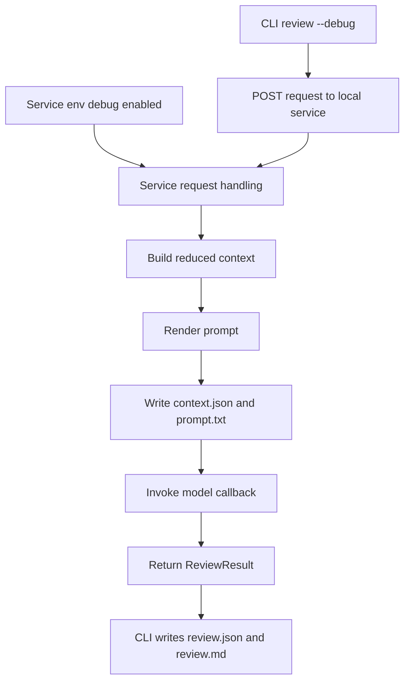
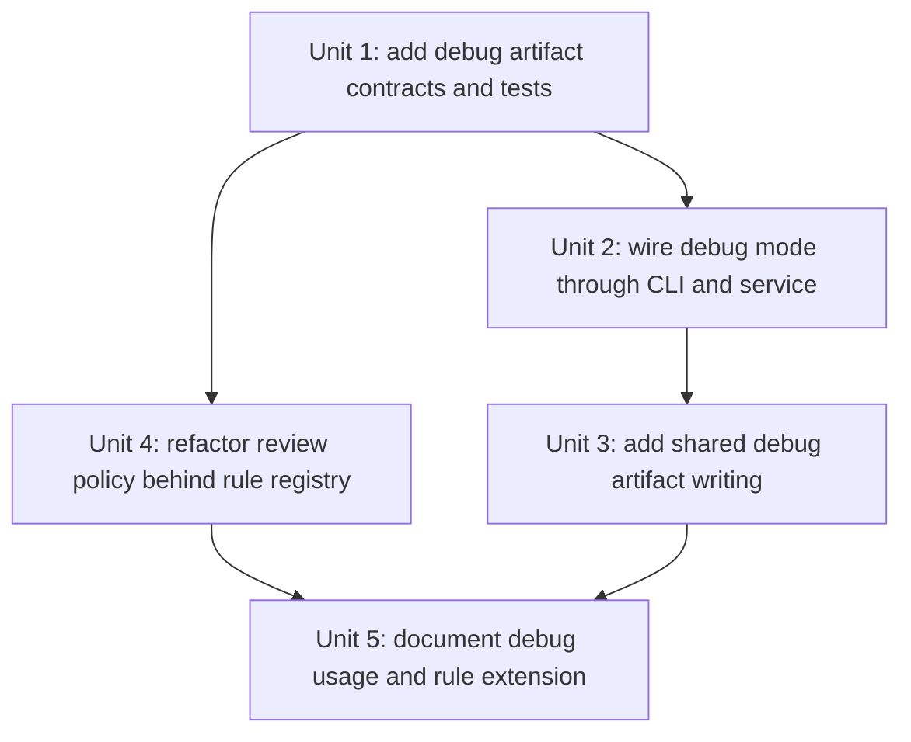

# feat: add debug mode and deterministic rule framework

## Overview

Extend the local-orchestrator review flow with an inspectable debug mode that writes the reduced model context and rendered prompt into the normal run directory, and refactor the deterministic dbt policy layer behind a lightweight rule registry so future manifest-based rules can be added in one predictable place without redesigning the review contract.

## Problem Frame

The current local-orchestrator path can now call Gemini directly on Vertex AI, but a developer still cannot inspect the exact reduced context and prompt for a specific run without instrumenting the code manually. Separately, the deterministic dbt rule layer has begun to accumulate useful checks, but those checks still live in one hard-coded function with no explicit extension point. This plan addresses both gaps while preserving the current run artifact shape and the existing `ReviewResult` contract.

## Requirements Trace

- R1. Support a debug mode that persists additional run artifacts for LLM-backed review inspection.
- R2. Write the reduced review context and rendered prompt for a run.
- R3. Place debug artifacts in the normal run output directory.
- R4. Allow debug mode from both the local service environment and CLI-driven local review runs.
- R5. Preserve normal run behavior when debug mode is disabled.
- R6. Expose a lightweight rule registration point for deterministic dbt review rules.
- R7. Do not add new deterministic rules in this pass.
- R8. Document how future deterministic rules should be added.
- R9. Preserve the existing `ReviewResult` and `Finding` contracts.

## Scope Boundaries

- Do not capture every internal intermediate or add full request tracing.
- Do not persist raw model responses in this pass.
- Do not add new deterministic dbt rules beyond the current ones.
- Do not build a plugin-discovery or package-loading system for rules.

## Context & Research

### Relevant Code and Patterns

- `src/dbt_vertex_agent/service_handlers.py` already owns the point where reduced context is assembled and the model callback is invoked. That is the natural place to capture debug artifacts because it sees both the reduced context and the rendered prompt before model execution.
- `src/dbt_vertex_agent/output.py` already owns run-directory creation for normal review artifacts. Debug artifacts should reuse this run-directory convention rather than invent a second layout.
- `src/dbt_vertex_agent/cli.py` already distinguishes local-service review mode from other execution modes. That makes it the right place to thread CLI-driven debug intent into the service path.
- `src/dbt_vertex_agent/review_policy.py` currently mixes registry concerns and concrete checks in one function. It should be split into “rule registration” and “rule execution” while preserving current findings and summaries.

### Institutional Learnings

- `docs/solutions/best-practices/teaching-comments-and-thin-agent-boundaries-2026-04-05.md` recommends thin LLM-facing layers and deterministic logic in normal Python modules.
- `docs/solutions/best-practices/local-orchestrator-bounded-vertex-context-2026-04-06.md` recommends local context reduction and bounded prompt construction before any Vertex call.

## Key Technical Decisions

- Persist `context.json` and `prompt.txt`, but not raw model responses.
  Rationale: These are the highest-signal artifacts for learning and debugging the prompt path without broadening scope into full wire tracing.
- Use the normal run directory as the debug artifact home.
  Rationale: A single run folder should contain the complete evidence for a run.
- Let the service own debug artifact generation, with the CLI only controlling whether debug mode is requested.
  Rationale: The service already sees the reduced context and rendered prompt, while the CLI does not.
- Introduce a minimal rule registry based on plain Python callables.
  Rationale: This keeps future rule additions obvious and testable without overbuilding a plugin architecture.

## Open Questions

### Resolved During Planning

- Should debug artifacts be written by the service or by the CLI?
  Resolution: The service should write them because it has direct access to reduced context and rendered prompt before the model call.
- How should CLI-triggered debug mode fit the current architecture?
  Resolution: Add a CLI flag for review runs and thread that intent into the local-service request path, while still supporting a service-side environment variable for `curl` and non-CLI clients.
- What is the smallest useful deterministic rule framework?
  Resolution: A single module-level registry of rule callables plus one helper that runs them all against a manifest and returns `Finding` objects.

### Deferred to Implementation

- How should the local-service HTTP contract express debug mode: query parameter, header, or multipart form field?
  Why deferred: This is an implementation detail of the current local-service boundary and does not affect the user-visible requirements.
- Should debug artifact writing be a separate helper in `output.py` or a service-specific helper?
  Why deferred: The implementation can choose the cleanest reuse point once tests are written.

## High-Level Technical Design

## Implementation Units

- [ ] **Unit 1: Add debug artifact contracts and tests**

**Goal:** Define the smallest shared structures needed to persist `context.json` and `prompt.txt` and prove the intended artifact shape through tests before wiring behavior.

**Requirements:** R1, R2, R3, R5

**Dependencies:** None

**Files:**
- Modify: `src/dbt_vertex_agent/output.py`
- Modify: `src/dbt_vertex_agent/service_contract.py`
- Test: `tests/test_service_contract.py`
- Test: `tests/test_rendering.py`

**Approach:**
- Introduce a service-level debug artifact dataclass or dictionary shape containing the serialized reduced context and the rendered prompt.
- Extend output writing to support optional debug artifacts without changing the behavior of normal runs.
- Keep `review.json` and `review.md` unchanged when debug mode is off.

**Test scenarios:**
- Happy path: debug artifact writer creates `context.json` and `prompt.txt` in the run directory.
- Edge case: debug mode off produces only the current normal artifacts.
- Integration: serialized debug context round-trips into valid JSON.

**Verification:**
- A run directory can contain the standard review artifacts plus the two debug artifacts with stable filenames.

- [ ] **Unit 2: Wire debug mode through CLI and service**

**Goal:** Allow debug mode to be turned on from both a CLI review flag and a service environment variable, with the service remaining the owner of debug artifact generation.

**Requirements:** R1, R3, R4, R5

**Dependencies:** Unit 1

**Files:**
- Modify: `src/dbt_vertex_agent/cli.py`
- Modify: `src/dbt_vertex_agent/http_client.py`
- Modify: `src/dbt_vertex_agent/service.py`
- Modify: `src/dbt_vertex_agent/service_handlers.py`
- Modify: `src/dbt_vertex_agent/config.py`
- Test: `tests/test_cli.py`
- Test: `tests/test_service.py`
- Test: `tests/test_http_client.py`

**Approach:**
- Add a `--debug` flag to the review command for local-service runs.
- Let the CLI communicate debug intent to the local service through the existing HTTP path.
- Add a service-side environment variable that enables debug mode for all requests, including `curl`.
- Keep non-debug requests on the current behavior path.

**Test scenarios:**
- Happy path: CLI debug flag results in the service treating the request as debug-enabled.
- Happy path: service env debug mode enables debug artifacts even for direct `curl`-style requests.
- Edge case: both CLI flag and service env are set; debug remains simply enabled with no conflicting behavior.
- Error path: non-debug requests still return the current stable response and artifact behavior.

**Verification:**
- Debug mode can be enabled either per review run or for the whole local service process.

- [ ] **Unit 3: Write `context.json` and `prompt.txt` from the service path**

**Goal:** Persist inspectable prompt-path artifacts for debug-enabled local-service runs.

**Requirements:** R1, R2, R3, R5

**Dependencies:** Unit 1, Unit 2

**Files:**
- Modify: `src/dbt_vertex_agent/service_handlers.py`
- Modify: `src/dbt_vertex_agent/prompting.py`
- Modify: `src/dbt_vertex_agent/output.py`
- Test: `tests/test_service.py`
- Test: `tests/test_rendering.py`

**Approach:**
- Reuse the same run ID used for the final `ReviewResult`.
- Render the prompt once before model invocation, then write `context.json` and `prompt.txt` when debug mode is enabled.
- Ensure the service writes the files into the same run directory later used for `review.json` and `review.md`.

**Test scenarios:**
- Happy path: debug-enabled local-service run writes `context.json` and `prompt.txt`.
- Edge case: model callback returns no payload and the deterministic fallback still leaves debug artifacts behind.
- Edge case: prompt artifact contains the exact rendered prompt text used for the model call.

**Verification:**
- A developer can inspect the exact reduced context and prompt for a completed debug-enabled run without modifying code.

- [ ] **Unit 4: Refactor deterministic review policy behind a lightweight rule registry**

**Goal:** Keep the current deterministic manifest checks, but reorganize them so future rules can be added in one clear place.

**Requirements:** R6, R7, R8, R9

**Dependencies:** None

**Files:**
- Modify: `src/dbt_vertex_agent/review_policy.py`
- Test: `tests/test_service.py`
- Test: `tests/test_review_contract.py`
- Create or modify: `tests/test_review_policy.py`

**Approach:**
- Define a plain rule callable shape, such as `rule(manifest: dict) -> list[Finding]`.
- Register the existing manifest rules through one module-level list or tuple.
- Add a single helper that executes all registered rules and returns combined findings.
- Preserve the existing `Finding` objects, finding messages, and result summary behavior.
- Add comments or docstrings showing how a future deterministic rule should be added.

**Test scenarios:**
- Happy path: the current missing-description and missing-column-description checks still produce the same findings through the registry.
- Edge case: an empty registry or empty manifest remains safe.
- Regression: summary/status behavior remains unchanged for existing findings.

**Verification:**
- A developer can open one policy module and see where new deterministic rules belong and how they are wired into result construction.

- [ ] **Unit 5: Document debug usage and rule extension guidance**

**Goal:** Update the repo docs so users can run debug mode and contributors know how to add future deterministic dbt rules.

**Requirements:** R2, R4, R8

**Dependencies:** Unit 2, Unit 3, Unit 4

**Files:**
- Modify: `docs/local-orchestrator-mode.md`
- Modify: `README.md`
- Optionally modify: `docs/solutions/best-practices/local-orchestrator-bounded-vertex-context-2026-04-06.md`

**Approach:**
- Add exact commands for starting the service with debug mode and for running the CLI with debug mode.
- Document the resulting files in the run directory.
- Add a short contributor note describing the deterministic rule registry and how to add a new rule later.

**Test scenarios:**
- N/A for prose, but commands and filenames must match the implemented behavior.

**Verification:**
- A new contributor can enable debug mode and understand where to add future deterministic rules without reading the entire implementation history.

## Acceptance Checklist

- [ ] `context.json` and `prompt.txt` are written for debug-enabled runs.
- [ ] Debug mode can be turned on from both the service environment and CLI-driven local review runs.
- [ ] Normal non-debug runs still write only `review.json` and `review.md`.
- [ ] Existing deterministic rules still produce the same findings through a lightweight registry.
- [ ] Docs explain both how to use debug mode and how to add future deterministic rules.
