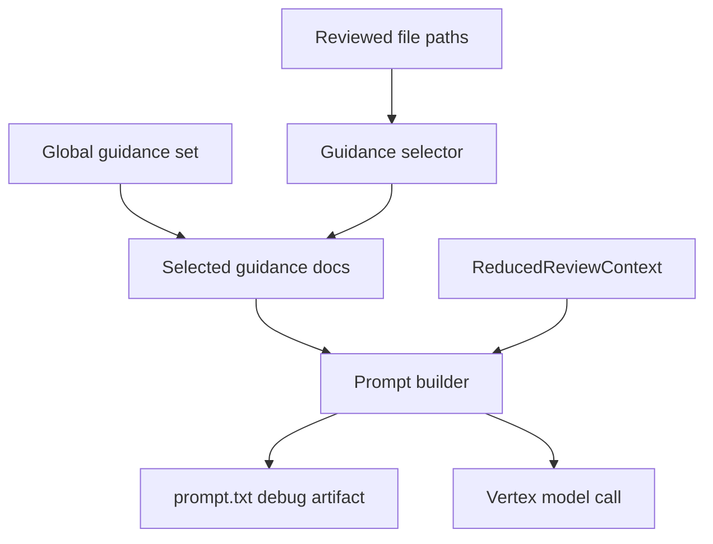
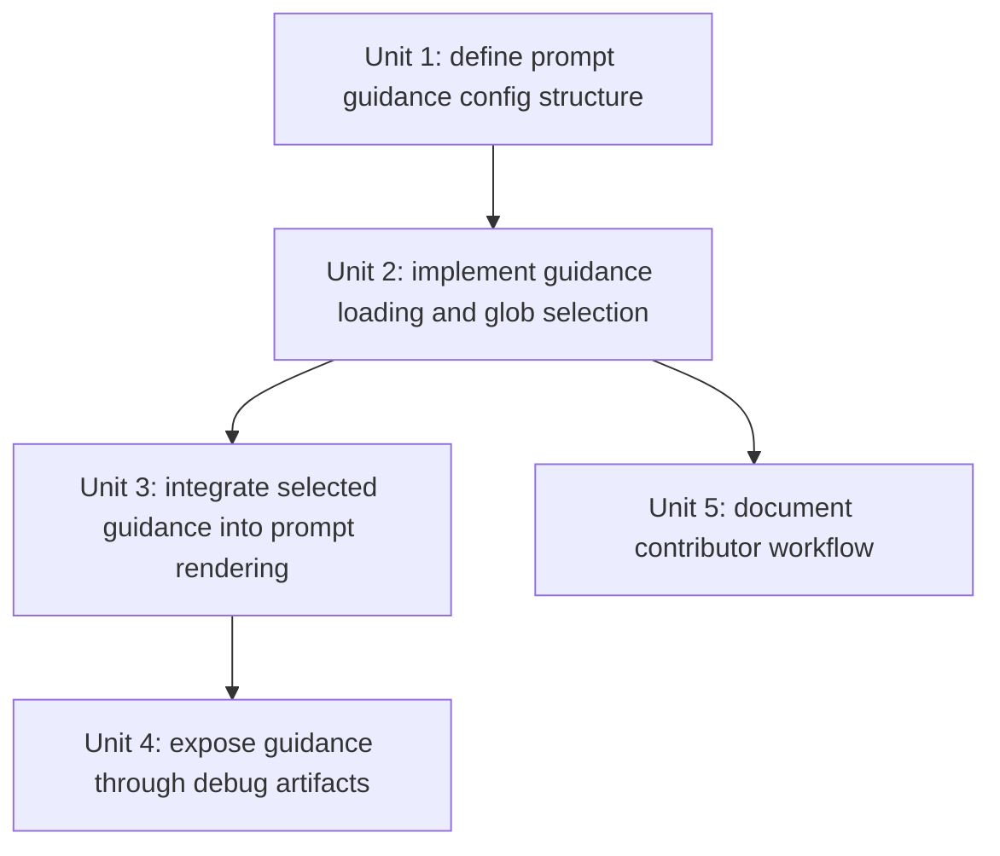

# feat: add prompt guidance config

## Overview

Add a repo-owned prompt guidance layer under `config/prompts/` so the local review service can always include a small global guidance set and conditionally include additional Markdown guidance based on glob matches against reviewed dbt file paths. Keep the selector system explicitly extensible for future manifest-based criteria, but implement only file-path glob matching in this pass.

## Problem Frame

The current prompt path in `src/dbt_vertex_agent/prompting.py` is a single hard-coded instruction block plus serialized reduced context. That is simple, but it forces project-specific guidance to live in Python and makes prompt behavior harder for contributors to customize. This change should make LLM guidance configurable from repo files while preserving deterministic prompt construction and easy debug inspection.

## Requirements Trace

- R1. Add prompt guidance under `config/prompts/`.
- R2. Always include a small fixed global guidance set.
- R3. Optionally include additional Markdown guidance based on reviewed-file glob matches.
- R4. Use file-path glob matching only in v1.
- R5. Keep the selection design extensible for future manifest-based selectors.
- R6. Make guidance selection deterministic and inspectable.
- R7. Include selected guidance in the rendered LLM prompt.
- R8. Expose included guidance through the existing debug prompt inspection path.
- R9. Produce a valid prompt even when no optional scoped guidance matches.
- R10. Document how to add new guidance files.
- R11. Document where future selector types would fit.

## Scope Boundaries

- Do not implement manifest-based selectors in this pass.
- Do not move deterministic review rules into Markdown guidance files.
- Do not add per-run user selection of prompt guidance files.
- Do not build a generic prompt templating engine.

## Context & Research

### Relevant Code and Patterns

- `src/dbt_vertex_agent/prompting.py` currently owns the rendered Gemini prompt and is the natural place to compose static instructions, selected guidance, and reduced context into one final prompt.
- `src/dbt_vertex_agent/service_handlers.py` already has the reviewed file list before prompt construction, so it can drive scoped guidance selection without additional parsing.
- `src/dbt_vertex_agent/service_contract.py` defines the reduced model-facing contract; guidance selection metadata can extend the prompt path without changing the core `ReviewResult` schema.
- The existing debug mode already writes `prompt.txt`, so prompt-guidance inspection can build on that instead of inventing a separate human-readable debug file.

### Institutional Learnings

- `docs/solutions/best-practices/local-orchestrator-bounded-vertex-context-2026-04-06.md` favors local context reduction and thin cloud-facing prompt construction. Prompt guidance files should behave like an additional bounded local input layer, not a new remote dependency.

## Key Technical Decisions

- Use `config/prompts/` as the runtime-owned guidance directory.
  Rationale: This keeps prompt configuration separate from docs and code while making its purpose obvious.
- Model the guidance system as two layers: fixed global guidance and scoped guidance rules.
  Rationale: This gives stable baseline behavior while still supporting folder-specific conventions.
- Use only file-path glob selectors in v1.
  Rationale: This is easy to debug and explain, while still covering many dbt project structures.
- Keep selector definitions data-driven enough that future selector types can be added without changing the folder layout.
  Rationale: The current request explicitly wants extensibility toward manifest-based criteria later.

## Open Questions

### Resolved During Planning

- Should prompt guidance files live under `docs/` or `config/`?
  Resolution: `config/prompts/` is the correct location because these files shape runtime prompt behavior rather than serving as prose documentation.
- Should the first version support mixed selection modes?
  Resolution: Yes, but only as “fixed global set plus glob-scoped additions.” Future selector types are deferred.
- How should prompt guidance remain inspectable?
  Resolution: Keep the final rendered prompt as the primary debug artifact and ensure guidance text is visible there.

### Deferred to Implementation

- What exact metadata file shape should describe scoped guidance rules?
  Why deferred: The implementation should pick the smallest durable format once the loading tests are written.
- Should guidance provenance also be captured in a structured debug artifact beyond `prompt.txt`?
  Why deferred: This is useful, but not required to satisfy the current requirements.

## High-Level Technical Design

## Implementation Units

- [ ] **Unit 1: Define prompt guidance config structure**

**Goal:** Introduce the `config/prompts/` layout and the minimal metadata needed to represent global guidance and glob-scoped guidance without implementing future selector types yet.

**Requirements:** R1, R2, R3, R5

**Dependencies:** None

**Files:**
- Create: `config/prompts/`
- Create: one or more initial global Markdown guidance files
- Create: a small selector metadata file for scoped guidance
- Test: `tests/test_prompting.py` or a new prompt-guidance test module

**Approach:**
- Create a small fixed global guidance set, likely as explicitly named Markdown files.
- Add a metadata file that maps file-path globs to scoped guidance Markdown files.
- Reserve space in the metadata format for future selector kinds, but keep only `glob` active in v1.

**Verification:**
- The repo contains a visible, documented prompt-guidance config area with at least one global example and one scoped example.

- [ ] **Unit 2: Implement guidance loading and glob-based selection**

**Goal:** Load global guidance files and select additional scoped guidance files deterministically from reviewed file paths.

**Requirements:** R2, R3, R4, R5, R6, R9

**Dependencies:** Unit 1

**Files:**
- Create: `src/dbt_vertex_agent/prompt_guidance.py`
- Modify: `src/dbt_vertex_agent/service_handlers.py`
- Modify: `src/dbt_vertex_agent/context_builder.py` or `src/dbt_vertex_agent/service_contract.py` if selected-guidance metadata needs to be carried explicitly
- Test: new `tests/test_prompt_guidance.py`

**Approach:**
- Add one loader for the fixed global guidance set.
- Add one selector that checks reviewed file paths against configured globs and deduplicates matched guidance files.
- Keep selection order stable so prompt rendering remains deterministic and testable.
- Structure the selector code so future selector types can be added as new dispatcher branches rather than forcing a rewrite.

**Test scenarios:**
- Happy path: reviewed files matching a configured glob include the expected scoped guidance file.
- Edge case: no scoped matches still returns the fixed global guidance set.
- Edge case: multiple reviewed files matching the same guidance rule include the guidance once.
- Regression: unsupported future selector kinds are ignored or fail clearly, depending on the chosen policy.

**Verification:**
- The service can compute a stable selected-guidance set from reviewed file paths alone.

- [ ] **Unit 3: Integrate selected guidance into prompt rendering**

**Goal:** Compose global guidance, scoped guidance, and reduced dbt context into the final rendered Gemini prompt.

**Requirements:** R6, R7, R9

**Dependencies:** Unit 2

**Files:**
- Modify: `src/dbt_vertex_agent/prompting.py`
- Modify: `src/dbt_vertex_agent/service_contract.py`
- Test: `tests/test_model_client.py` and prompt-specific tests

**Approach:**
- Extend the prompt builder to accept selected guidance content explicitly rather than reading files inside the renderer.
- Keep the reduced dbt context contract intact while making the prompt structure readable and debug-friendly.
- Make sure the prompt still works when only the global guidance set is present.

**Verification:**
- The final prompt visibly includes the selected guidance content before the serialized reduced context.

- [ ] **Unit 4: Expose guidance through debug artifacts**

**Goal:** Make included guidance visible in the existing debug path so a developer can inspect what shaped a run.

**Requirements:** R6, R8

**Dependencies:** Unit 3

**Files:**
- Modify: `src/dbt_vertex_agent/service_handlers.py`
- Modify: `src/dbt_vertex_agent/output.py` only if a structured provenance artifact is chosen
- Test: `tests/test_service.py`

**Approach:**
- Rely on `prompt.txt` as the primary debug artifact for v1.
- Optionally include selected-guidance metadata in `context.json` if that falls out cleanly from the implementation.
- Avoid adding separate debug files unless they clearly improve inspection value.

**Verification:**
- A debug-enabled run makes it obvious which guidance content influenced the final prompt.

- [ ] **Unit 5: Document contributor workflow**

**Goal:** Explain how to add new prompt guidance files and how future non-glob selectors should fit into the system.

**Requirements:** R10, R11

**Dependencies:** Unit 1, Unit 2, Unit 3

**Files:**
- Modify: `docs/local-orchestrator-mode.md`
- Modify: `README.md`
- Optionally add: a small `config/prompts/README.md`

**Approach:**
- Show where global guidance files live.
- Show how to add a new glob-scoped guidance file and metadata entry.
- Note explicitly that manifest-based selectors are not implemented yet, but the selector system was structured to allow them later.

**Verification:**
- A contributor can extend the prompt-guidance layer without reverse-engineering prompt construction from Python first.

## Acceptance Checklist

- [ ] `config/prompts/` exists with global guidance and scoped-guidance examples.
- [ ] The service selects scoped guidance via reviewed-file glob matches.
- [ ] The rendered prompt includes the selected guidance plus reduced dbt context.
- [ ] Debug mode makes the included guidance inspectable.
- [ ] Docs explain both current glob matching and future selector extensibility.
