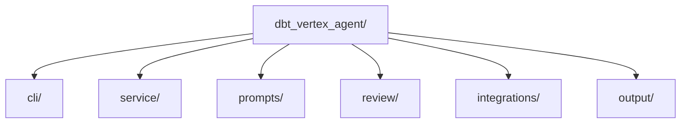
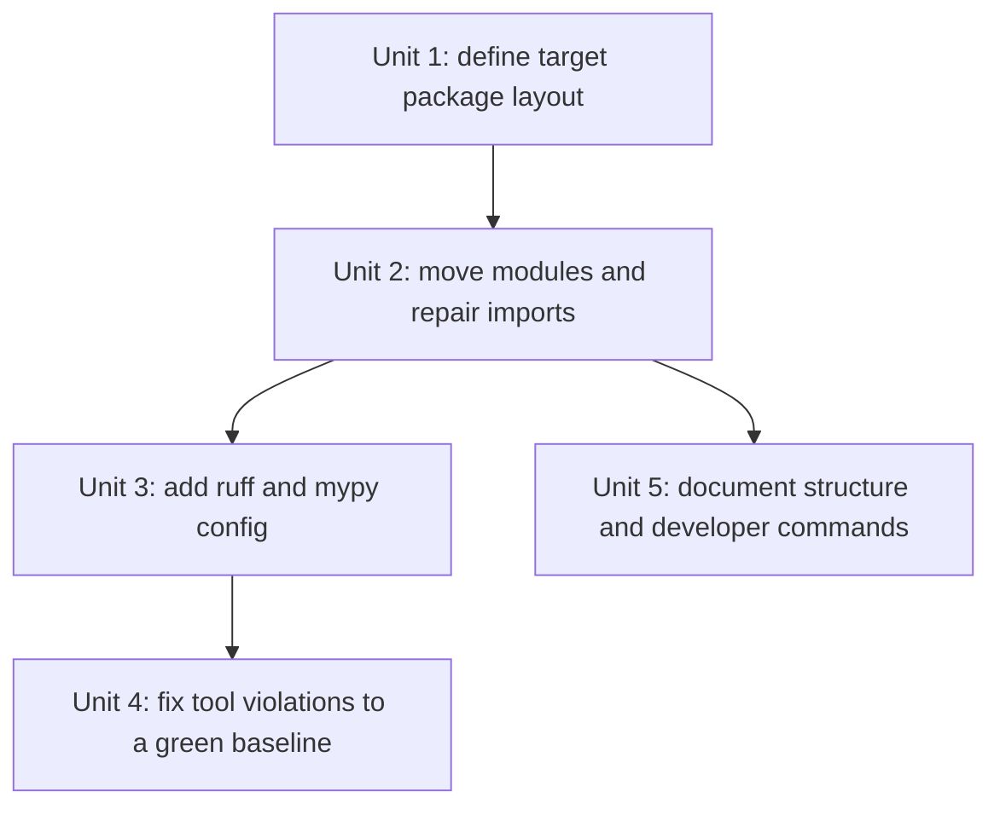

# feat: add shallow subpackages and python quality tooling

## Overview

Refactor the flat `src/dbt_vertex_agent/` package into a small number of shallow subpackages organized by responsibility, and add a modern Python quality toolchain built around `ruff format`, `ruff check`, and strict `mypy`. The refactor should improve navigability and cognitive load without creating a deep hierarchy or adding overlapping lint tools.

## Problem Frame

The current package started as a simple greenfield scaffold, but it now contains enough distinct concerns that the flat module list is becoming harder to scan. At the same time, the repo still relies mainly on tests for quality enforcement and lacks a standard formatter/linter/type-check setup. This work should make the codebase easier to navigate and reason about while also making code quality expectations explicit and enforceable.

## Requirements Trace

- R1. Split internals into a minimal set of shallow responsibility-based subpackages.
- R2. Keep the hierarchy shallow and avoid speculative organization.
- R3. Preserve current CLI and runtime behavior.
- R4. Improve readability and module boundaries using Ousterhout/Hermans-inspired principles.
- R5. Add `ruff format`.
- R6. Add `ruff check`.
- R7. Add strict `mypy`.
- R8. Do not add `pylint`.
- R9. Keep config consolidated where practical.
- R10. Document the intended package structure and module-boundary thinking.
- R11. Document how to run quality tools locally.
- R12. Keep the toolchain strong but maintainable.

## Scope Boundaries

- Do not redesign the runtime architecture while moving files.
- Do not split into many nested subpackages.
- Do not add overlapping tools beyond `ruff` and `mypy`.
- Do not chase perfect typing purity if it causes disproportionate churn; use a pragmatic strict baseline.

## Context & Research

### Relevant Code and Patterns

- The current flat package contains clear responsibility groupings already:
  - CLI and packaging
  - local service
  - prompt and guidance
  - review logic and contracts
  - remote/cloud integration
  - output/rendering
- `pyproject.toml` already owns packaging metadata, so it is the natural place to add `ruff` and `mypy` configuration.
- Tests already cover a broad portion of the codebase and should act as the main safety net for import-path and module-move regressions.

## Key Technical Decisions

- Use a minimal split by responsibility rather than a full architectural tree.
  Rationale: The repo is large enough to justify grouping, but not large enough for deep nesting.
- Keep top-level package identity `dbt_vertex_agent`.
  Rationale: Packaging and CLI identity are already established and should not be renamed.
- Use `ruff` for both formatting and linting.
  Rationale: This reduces tool overlap and configuration burden.
- Use strict `mypy`, with targeted exceptions only where needed to keep the transition realistic.
  Rationale: The user wants a strong type discipline, but not a second heavyweight linter.

## Open Questions

### Resolved During Planning

- Should `pylint` be included for stronger checks?
  Resolution: No. The quality stack will be `ruff format`, `ruff check`, and strict `mypy`.
- Should the split be aggressive or minimal?
  Resolution: Minimal, shallow, responsibility-based grouping.

### Deferred to Implementation

- What exact subpackage names give the cleanest balance of clarity and stability?
  Why deferred: The implementation should confirm the cleanest grouping against the current imports and tests before moving files.
- Which strict `mypy` issues require immediate cleanup versus configuration exceptions?
  Why deferred: This should be determined from actual tool output once `mypy` is added.

## High-Level Technical Design

The intent is conceptual, not prescriptive: the final grouping should stay shallow and map to real responsibilities already present in the codebase.

## Implementation Units

- [ ] **Unit 1: Define the shallow subpackage layout**

**Goal:** Decide the smallest useful set of subpackages based on real current responsibilities, and avoid turning the package tree into a taxonomy exercise.

**Requirements:** R1, R2, R4

**Dependencies:** None

**Files:**
- Modify: `src/dbt_vertex_agent/`
- Update tests and docs as needed once the layout is chosen

**Approach:**
- Group modules by actual responsibility boundaries already visible in the repo.
- Prefer a few shallow subpackages such as:
  - `cli/`
  - `service/`
  - `prompts/`
  - `review/`
  - `integrations/`
  - `output/`
- Keep module moves justified by clearer mental models, not symmetry.

**Verification:**
- The proposed package tree is visibly easier to scan than the current flat module list.

- [ ] **Unit 2: Move modules and repair imports**

**Goal:** Relocate modules into the new shallow subpackages while preserving behavior and stable entrypoints.

**Requirements:** R1, R2, R3

**Dependencies:** Unit 1

**Files:**
- Modify: `src/dbt_vertex_agent/**`
- Modify: tests that import moved modules
- Modify: `pyproject.toml` if entrypoint paths need to change

**Approach:**
- Move modules in small responsibility-based batches.
- Preserve `dbt_vertex_agent.cli:main` or introduce a thin compatibility shim if the internal location changes.
- Prefer compatibility imports only where they meaningfully reduce churn; do not leave a large layer of stale forwarding modules indefinitely.

**Test scenarios:**
- Existing tests continue to pass after import-path changes.
- The CLI entrypoint still works.

**Verification:**
- The package is reorganized without changing the user-visible behavior of the current CLI/service flow.

- [ ] **Unit 3: Add `ruff` and strict `mypy` configuration**

**Goal:** Add maintainable project-level config for formatting, linting, and strict typing.

**Requirements:** R5, R6, R7, R8, R9, R12

**Dependencies:** None

**Files:**
- Modify: `pyproject.toml`
- Optionally create: `mypy.ini` only if `pyproject.toml` proves insufficient

**Approach:**
- Configure `ruff format`.
- Configure `ruff check` with a strong but maintainable rule selection.
- Configure `mypy` in strict mode, then handle real issues pragmatically rather than weakening the intent up front.
- Avoid adding `pylint` or extra overlapping lint tools.

**Verification:**
- The repo has one clear set of commands for format, lint, and type check.

- [ ] **Unit 4: Fix quality-tool findings to a green baseline**

**Goal:** Bring the existing codebase to a passing state under the new toolchain.

**Requirements:** R5, R6, R7, R12

**Dependencies:** Unit 2, Unit 3

**Files:**
- Modify: Python source and tests as needed

**Approach:**
- Run `ruff format`, `ruff check`, and `mypy`.
- Fix violations in a way that improves clarity rather than gaming the tools.
- Use targeted ignores only where justified and documented.

**Verification:**
- The codebase passes tests plus the new quality-tool commands.

- [ ] **Unit 5: Document package structure and developer workflow**

**Goal:** Explain the new subpackage layout and how to run the tooling locally.

**Requirements:** R10, R11

**Dependencies:** Unit 2, Unit 3, Unit 4

**Files:**
- Modify: `README.md`
- Optionally create: `docs/structure.md` or `ONBOARDING.md`

**Approach:**
- Document the shallow package layout and the reasoning behind it.
- Document the exact format/lint/type-check commands.
- Keep the explanation aligned with the repo’s “small but serious” quality bar.

**Verification:**
- A new contributor can understand the package layout and run the quality checks without guesswork.

## Acceptance Checklist

- [ ] The flat package has been reorganized into a small number of shallow subpackages.
- [ ] CLI/runtime behavior remains stable.
- [ ] `ruff format`, `ruff check`, and strict `mypy` are configured.
- [ ] The codebase reaches a passing baseline under tests and the new tools.
- [ ] Docs explain both structure and local quality-tool commands.
